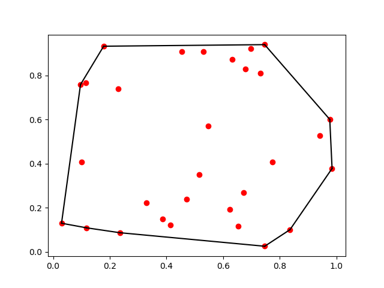

class: middle, center


# PythonCall.jl 周りのお話


```
更新日: 2023-06-25T04:18:40.954
```


お勉強会資料はこちら https://github.com/terasakisatoshi/Cerastes.jl 


---


# PythonCall.jl について


  * Julia から Python を呼ぶパッケージ
  * [2022/02](https://discourse.julialang.org/t/ann-pythoncall-and-juliacall/76778) ごろにアナウンス
  * Non-copying conversions
  * Python の環境を Julia のプロジェクト毎に管理できる
  * CondaPkg.jl で Python の依存関係を管理


### 双対概念として


  * 適切な言い方かはわからないが Python から Julia を呼ぶ際の対応概念・技術をここでは双対概念と呼ぶことにする．
  * Python から Julia を呼びたい場合 `juliacall` を使える
  * `juliapkg` で Python 環境毎に Julia の環境を管理できる（らしい）


---


# Non-copying conversions について


Python の処理を Julia から受け取る場合, PyCall.jl ではコピーが生じる.


```julia
using PyCall

py"""
import numpy as np
x = np.array([1,2,3])
def getx():
    global x
    return x
"""

pyx = py"getx"()
@assert pyx[1] == 1

pyx[1] = -999
@assert py"getx"()[1] == 1
```


--


回避策はある(下記のようにする)


```julia
jlx = pycall(py"getx", PyArray) # 戻り値の型を PyArray とする
jlx[1] = -999
@assert py"getx"()[1] == -999
```


---


# Non-copying conversions


PythonCall.jl の場合, NumPy の配列のような mutable オブジェクトのコピーを作らない. 戻り値は　Python のオブジェクトのように操作ができる.


```python
# mylib.py
import numpy as np
x = np.array([1,2,3])
def getx():
    global x
    return x
```


```julia
using PythonCall

# https://github.com/cjdoris/PythonCall.jl/issues/70
pyimport("sys").path.append(@__DIR__)

mylib = pyimport("mylib")

pyx = mylib.getx()
pyx[0] = -999
isequal = mylib.x[0] == -999
isequal |> typeof == Py # これが仕様なのかわからないが，現時点ではこのようになる．
@assert Bool(isequal)
```


---


# Installation


### Julia から Python を呼びたい


```julia-repl
julia> using Pkg; Pkg.add("PythonCall")
```


### Python から Julia を呼びたい


```console
$ pip3 install juliacall
$ python
>>> import juliacall
>>> jl = juliacall.Main
>>> juliacall.Pkg.add("Example")
>>> jl.seval("using Example")
>>> jl.Example.hello("Azarashi")
'Hello, Azarashi'
```


---


# 注意: `using PythonCall` を行う前に


  * 環境変数 `JULIA_PYTHONCALL_EXE` を指定することで連携したい Python を指定することができる．[詳しくはこちら](https://cjdoris.github.io/PythonCall.jl/stable/pythoncall/#pythoncall-config)


```julia-repl
julia> ENV["JULIA_PYTHONCALL_EXE"]="path/to/python.exe"
```


#### [PyCall.jl](https://github.com/JuliaPy/PyCall.jl) に慣れている場合


読者が [PyCall.jl](https://github.com/JuliaPy/PyCall.jl) エコシステムを理解しており PyCall.jl と同じ Python を使用したい場合は下記のようにする:


```julia-repl
julia> ENV["JULIA_PYTHONCALL_EXE"]="@PyCall"
```


こちらでも良い


```julia-repl
using PythonCall; ENV["PYTHON"]=PythonCall.C.CTX.exe_path; using Pkg; Pkg.build("PyCall")
```


#### デフォルトの挙動


アクティベートしている Julia パッケージ直下に `.CondaPkg` が作られ [micromamba](https://mamba.readthedocs.io/en/latest/user_guide/micromamba.html) によって Python が導入される．


---


# どの Python を用いているかを確認する


## PyCall.jl の場合


```julia-repl
julia> using PyCall
julia> Base.Filesystem.contractuser(PyCall.pyprogramname)
```


[SciPy.jl の `print_configurations()`](https://github.com/AtsushiSakai/SciPy.jl/blob/83606f65414814ec0650493f53c654a11ab48b36/src/SciPy.jl#L330-L344) がわかりやすい．


## PythonCall.jl


```julia-repl
julia> using PythonCall
julia> Base.Filesystem.contractuser(PythonCall.C.CTX.exe_path)
"~/work/Cerastes.jl/.CondaPkg/env/bin/python"
```


---


# [CondaPkg.jl](https://github.com/cjdoris/CondaPkg.jl)


PyCall.jl は [Conda.jl](https://github.com/JuliaPy/Conda.jl) によって Python の依存関係を制御することができていた．


[CondaPkg.jl](https://github.com/cjdoris/CondaPkg.jl) は PythonCall.jl における Conda.jl みたいなもの


Julia のプロジェクト毎に依存関係を管理できる


```console
$ cat CondaPkg.toml

[pip.deps]
matplotlib = ""
scipy = ""
```


```julia
julia> using CondaPkg; CondaPkg.add_pip("sympy")
```


```console
$ cat CondaPkg.toml
[pip.deps]
matplotlib = ""
sympy = "" # <-- ここが増えている
scipy = ""
```


---


# 気になること


### 運用例はあるか？


  * 結論: ある∃. [PyPlot.jl](https://github.com/JuliaPy/PyPlot.jl) のバックエンドを PythonCall.jl にした[PythonPlot.jl](https://github.com/JuliaPy/PythonPlot.jl)


### 互換性について


  * PyCall.jl ベースで作られているライブラリと連携できるか？ 🧐

      * 結論: できる∃! (後述する)
  * PyCall.jl に依存している部分を PythonCall.jl で置き換えられるか？

      * 挙動が異なる部分があるので注意.


---


class: middle, center


# 例: 凸包の計算する機能を呼び出す


[scipy.spatial.ConvexHull](https://docs.scipy.org/doc/scipy/reference/generated/scipy.spatial.ConvexHull.html)





---


# 使うパッケージのバージョン


```julia
using Pkg
Pkg.status()
```


```
Status `~/work/Cerastes.jl/Cerastes.jl/slideshow/Project.toml`
  [992eb4ea] CondaPkg v0.2.18
  [916415d5] Images v0.25.3
  [16fef848] LiveServer v1.2.0
  [6fe1bfb0] OffsetArrays v1.12.9
  [6099a3de] PythonCall v0.9.13
  [274fc56d] PythonPlot v1.0.2
  [79b45036] Remark v0.3.3
```


---


# Python 版


```python
from scipy.spatial import ConvexHull
import matplotlib.pyplot as plt
import numpy as np

rng = np.random.default_rng()
points = rng.random((30, 2))   # 30 random points in 2-D
hull = ConvexHull(points)
plt.plot(points[:, 0], points[:, 1], "o")
for simplex in hull.simplices:
    plt.plot(points[simplex, 0], points[simplex, 1], "k-")
```


これの Julia 版を考える


---


# PythonCall.jl + pyimport("scipy")


```julia
using Random
using PythonCall
using OffsetArrays: Origin
using PythonPlot: pyplot as plt

# ゼロ始まりの配列を作る
points = Origin(0, 0)(rand(Xoshiro(0), 30, 2))

ConvexHull = PythonCall.pyimport("scipy.spatial").ConvexHull
hull = ConvexHull(points)

fig, ax = plt.subplots()
ax.plot(points[:, 0], points[:, 1], "ro")

for pysimplex in hull.simplices
    # pysimplex は Python オブジェクトとして見えている
    # Py -> PyArray # AbstractArray のサブタイプとしてみなす
    simplex = PyArray(pysimplex)
    # このようにしないと Indexing でエラーが起きるため
    ax.plot(points[simplex, 0], points[simplex, 1], "k-")
end

fig.savefig("plot1.png")
```


---


# Julia のデータを Python のオブジェクトに変換


  * `points = Py(rand(rng, 30, 2)).to_numpy()` のようにすると [NumPy のデータとして扱える](https://cjdoris.github.io/PythonCall.jl/stable/faq/#Issues-when-Numpy-arrays-are-expected)．添え字として `0` や `-1` が使える. ただし `points[:, 0]` のような構文は現時点では使えてない. `getindex` を呼ぶために `Colon()` の処理が適切になされていないため？
  * `points[pybuiltins.None, 0]` は Python ユーザにとって意図した挙動にならない
  * `points[pybuiltins.slice(pybuiltins.None), 0]` による解決策がある.
  * Pythonista にとっては最も親和性が高いが後もう少し


```julia
using Random
using PythonCall
using PythonPlot: pyplot as plt

ConvexHull = PythonCall.pyimport("scipy.spatial").ConvexHull
rng = Xoshiro(0)
points = Py(rand(rng, 30, 2)).to_numpy()
hull = ConvexHull(points)

fig, ax = plt.subplots()
ax.plot(points[pybuiltins.slice(pybuiltins.None), 0], points[pybuiltins.slice(pybuiltins.None), 1], "ro")
for simplex in hull.simplices
    ax.plot(points[simplex, 0], points[simplex, 1], "k-")
end
```


---


# PythonPlot.jl / SciPy.jl


  * [SciPy.jl](https://github.com/AtsushiSakai/SciPy.jl) のバックエンドは PyCall.jl である.


```julia
using Random

using Images
using OffsetArrays: OffsetArrays, Origin
using PythonPlot: pyplot as plt
using SciPy

points = Origin(0,0)(rand(Xoshiro(0), 30, 2))
hull = SciPy.spatial.ConvexHull(points)

fig, ax = plt.subplots()
ax.plot(points[:,0], points[:,1], "o")
for simplex in eachrow(hull.simplices) # 注意
    ax.plot(points[simplex, 0], points[simplex, 1], "k-")
end
```


  * SciPy.jl/PyCall.jl では `hull.simplices` の戻り値は `Matrix{Int32}` として処理される. Python 実装をリスペクトする場合は `eachrow(hull.simplices)` を回す必要がある.
  * 次のページも見よ．


---


### 補足(バックエンドの差異)


```julia
 using Random, SciPy; SciPy.spatial.ConvexHull(rand(Xoshiro(0), 30, 2)).simplices |> collect
10×2 Matrix{Int32}:
 23   6
  7  17
  7   6
 13   4
 13  23
 26   5
 21  17
 21   5
 19   4
 19  26
```


```julia
julia> using Random, PythonCall
julia> ConvexHull = PythonCall.pyimport("scipy.spatial").ConvexHull
julia> ConvexHull(rand(Xoshiro(0), 30, 2)).simplices |> collect
10-element Vector{Py}:
 array([23,  6], dtype=int32)
 array([ 7, 17], dtype=int32)
 array([7, 6], dtype=int32)
 array([13,  4], dtype=int32)
 array([13, 23], dtype=int32)
 array([26,  5], dtype=int32)
 array([21, 17], dtype=int32)
 array([21,  5], dtype=int32)
 array([19,  4], dtype=int32)
 array([19, 26], dtype=int32)
```


---


class: middle, center


# Python から Julia を呼びたい場合


`juliacall`, `juliapkg`


---


# Python から Julia を呼ぶ


機械学習の社会実装といった産業上での要請から Python, Web 開発 のライブラリ，エコシステム充実している．後発の Julia は次の懸念点を持たれてしまう:


```
- Python じゃだめなの？
- エコシステムはどれぐらい充実してるの？
- Python で書いた既存の資源は？
- すでに動いているサービスがあるのだけれど？
- これ以上新しいこと覚えてたくない
- 仮にスクラッチで Julia で書いた場合，どのように使えばいいのか？
```


これらの懸念点にある心理的な不安の解消として Python から Julia を呼べる仕組みが PyCall.jl/PythonCall.jl のように気軽にできる仕組みが望まれる．


  * `juliacall` は PythonCall.jl の双対概念に対応する．
  * `juliapkg` は CondaPkg.jl の双対概念に対応する．


---


# 使い方


  * 詳しくは [Getting started](https://cjdoris.github.io/PythonCall.jl/stable/juliacall/#Getting-started) を参照のこと


```console
$ pip3 install juliacall
$ python
>>> import juliacall
>>> jl = juliacall.Main
>>> juliacall.Pkg.add("Example")
>>> jl.seval("using Example")
>>> jl.Example.hello("Azarashi")
'Hello, Azarashi'
```


  * `jl.<func>(<args>)` のような呼び出し方を使う. `seval` は便利だが呼び出しのオーバヘッドがあることに注意.


Python パッケージを書く開発者は Main モジュールに拡張機能を書かずに `newmodule` によって名前空間の汚染を避けることが推奨されているようだ．


```python
import juliacall
jl = juliacall.newmodule("MyModule")
```


---


# 興味深いこと


```python
import juliacall
import numpy as np

jl = juliacall.Main
jl.Pkg.activate(jl.Base.current_project())
jl.Pkg.instantiate()

jl.seval("using Images")
```


```python
H, W = 2 ** 4, 2 ** 4
pyimg = np.array(range(0, 256)).astype(np.uint8).reshape(H, W).T

jlimg = jl.reinterpret(jl.N0f8, jl.reshape(jl.seval("UInt8(0):UInt8(255) |> collect"), H, W))

assert np.all(pyimg / 255 == jlimg)
```


Julia の `UnitRange` は Python の range に変換されるようである． `UInt8(255) + UInt8(1)` という変換を行なっているせいか `jl.UnitRange[jl.UInt8](jl.UInt8(0), jl.UInt8(255))` は `range(0, 0)` になる．．．辛い．


---


# まとめ


  * パッケージ開発者が機械的に Python と連携するバックエンド(PyCall.jl や PythonCall.jl のこと) を置き換えるべきかはもう少し議論が必要.
  * Python ユーザーが Julia を使う時は juliacall が良さそう

      * PyCall.jl の双対概念の pyjulia に比べるとインストールトラブルが少なかった印象
  * ２箇所ほどコントリビューションチャンス見つけたよ 😇


以上．

